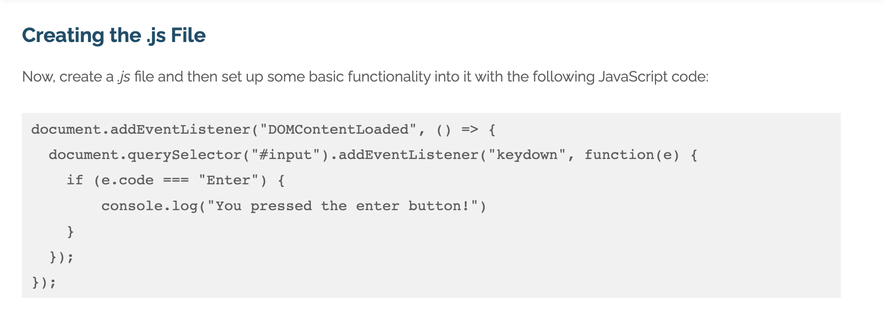
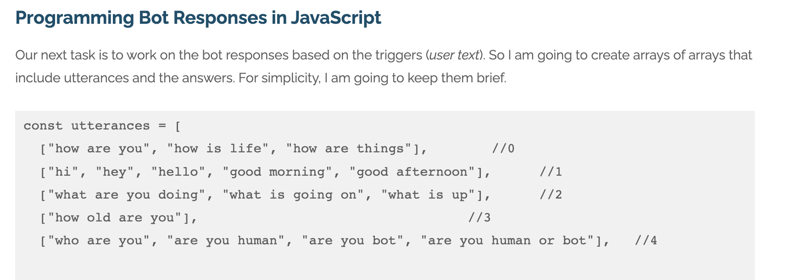
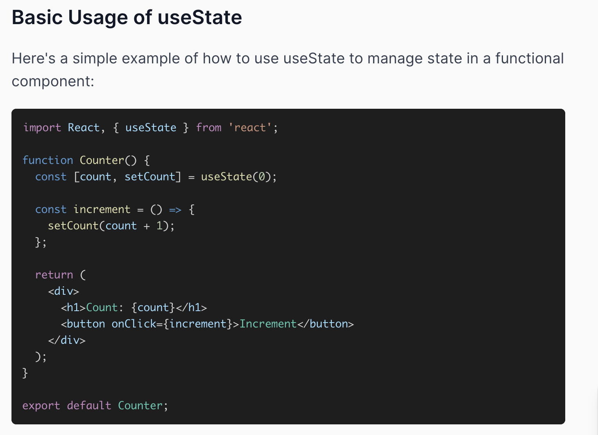

# Inspired Code

Here is a list of inspired codes that influenced me throughhout my coding Journey.

### Overview

1. Building a JavaScript Chatbot Inspired Codes
2. Exploring ReactJS Hooks: `useState` and `useEffect`

## 1. Building a JavaScript Chatbot Inspired Codes

**Source:** [HTML Goodies - Basic Chatbot in JavaScript](https://www.htmlgoodies.com/javascript/basic-chatbot-in-javascript/)

### Overview

For one of my initial assignments, I embarked on the challenge of constructing a JavaScript-based chatbot application. This marked my first solo exploration into JavaScript, and I sought inspiration on essential aspects such as iterating through responses, tracking user progress, and best practices for response storage. The journey led me to a foundational example that significantly influenced my approach.

Some Questions included:

- How do I iterate through layers of potential responses
- How do I save where the user is in the chatbot questioning
- What are best practices when it comes to storing potential responses

### Findings

The example app, comprising standard `index.html` and `index.css` files, featured functions using if statements to handle diverse user responses. This approach, though seemingly obvious, provided valuable insights into JavaScript practices. The use of if statements to check user responses made it an ideal starting point for my first JavaScript project.



> _Screen shot inspired code from [HTML Goodies](https://www.htmlgoodies.com/javascript/basic-chatbot-in-javascript/)_

### Implementation

In my chatbot app, I applied lessons from the example code. I utilized a numbering system and conditions to track the user's progress. Leveraging React, I enhanced UI interaction. Below is a snippet demonstrating conditional responses based on user input:

```javascript
const getBotReply = (msg) => {
  if (msg.toLowerCase() === "random") {
    return `And your random movie is .........drum roll........ ${getRandomMovie(
      randomMovies
    )}!`;
  }

  if (msg.toLowerCase() === "restart") {
    return "Hi there my name is Archie and my job is to help you find the perfect animated moie for you to watch. <br /><br />But firstly, what is your Name?";
  }

  if (level === 1) {
    level++;
    name = msg;
    return `Thats a nice name ${name}, nice to meet you! Now please tell me do you enjoy watching animated films?`;
  }

  if (level === 2) {
    level++;
    if (msg.toLowerCase() === yesValues) {
      // path = "yes";
      return "GREAT... I mean *ahem* great. So do you like movies that will bring on the waterworks or movies that make you laugh?";
    }

    if (msg.toLowerCase() === noValues) {
      // path = "no";
      return "Well this is a bit awkward... kinda defeats my purpose completely but you do you I guess. Sorry I cant be much help to you today. If you want to restart type 'restart' or type 'random' for a randomly selected movie";
    }
  }
};
```

> _This code is directly from my chatbot repository_

### Findings

This example that my source uses containing global array variables declared at the start of the application containing a bunch of string values, again this is an obvious way to structure the application but as I was a spring chicken in this space I was looking for inspiration as to how I might structure my app.



> _Screen shot inspired code from [HTML Goodies](https://www.htmlgoodies.com/javascript/basic-chatbot-in-javascript/)_

### Implementation

In my app I followed the theme of using global variables to store strings which I could refer to later on in my app. I ended up using an object structure which meant all my chatbot responses were included in the object properties. However I did use the array variable to store all my potential end result answers. Because the array was at the top level this means at any stage the chatbot could’ve responded with any of the possible answers contained in the array. I also decided to include possible user answers in OR string variables meaning the user could respond with “yes” “yep” “yeah” etc at any point in the app and the response would be considered as valid this prevents repeated code throughout the app.

```javascript
const yesValues = "yes" || "yup" || "yeah" || "y";
const noValues = "no" || "nope" || "n" || "nah";
const randomMovies = [
  "Shrek",
  "Ice Age",
  "Kung-Fu Panda",
  "Up",
  "Onward",
  "Big Hero 6",
  "Finding Nemo",
  "The Lion King",
  "Inside Out",
];

let level = 1;
let path;
let name;
```

> _This code is directly from my chatbot repository_

## 2. Exploring ReactJS Hooks: `useState` and `useEffect`

**Source:** [codedamn - Understanding useState and useEffect Hooks in ReactJS](https://codedamn.com/news/reactjs/usestate-and-useeffect-hooks)

### Overview

My fascination with ReactJS, particularly its JSX implementation for HTML-looking components, led me to delve into React-specific functionalities. Among these, the `useEffect` and `useState` hooks caught my attention. The `useEffect` function intrigued me for its role in managing side effects within the app. Contrary to a common misconception, it extends beyond the initial app loading, enabling execution based on various conditions throughout the component's lifecycle. This flexibility proves beneficial for tasks like data fetching during mounting or cleanup during unmounting. Additionally, `useState` facilitates the management of local state in functional components, triggering re-renders upon state updates. Together, `useEffect` and `useState` provide an efficient and controlled approach to state and side effect management in React applications.

### Findings

In the provided resource, a simple example demonstrates the usage of the `useEffect` and `useState` hooks to `fetch` and store data. The example focuses on a getUsers function with a `fetch` request inside a `useEffect`. Upon receiving data, the `useState `hook is employed to store the users' data within a users state using setUsers. A similar approach was adopted in my online shop app, where I utilised the same method to `fetch` and store product data.



> \_Screen shot inspired code from [codedamn](https://codedamn.com/news/reactjs/usestate-and-useeffect-hooks)

### Implementation

In my online shop app I used the same method to get my products by using a `fetch` request inside the `useEffect` and then using the `useStat`e hook to store that data

```javascript
getProducts.js;

const getProducts = async () => {
  // Use the following URL for your fetch request
  const url = `${process.env.REACT_APP_API_URL}/products`;

  // Fetch products and prices from the Stripe API
  const response = await fetch(url);
  console.log(response);
  const products = await response.json();
  console.log(products);
  return products;
};

export { getProducts };

App.js;

// The function that makes the fetch request to the Products API
import { getProducts } from "./services/getProducts";

function App() {
  const [products, setProducts] = useState([]);

  useEffect(() => {
    const loadData = async () => {
      const products = await getProducts();
      setProducts(products);
    };
    loadData();
  }, []);

  return (
    <div className="container">
      {products.map((product) => (
        <div key={product.id} className="product-grid">
          
          <h2>{product.name}</h2>
          <p className="description">{product.description}</p>
          <p className="price">${product.prices[0].unit_amount / 100}</p>
          <button
            onClick={() => {
              checkout(product.prices[0].id);
            }}
          >
            Buy Now
          </button>
        </div>
      ))}
    </div>
  );
}
```

> _This code is directly from my keyme online shop repository_
