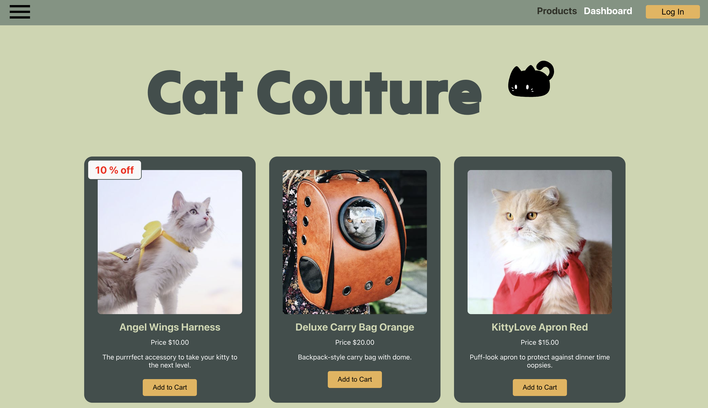

# My Codes

Here you will find a list of projects and exercise repository links I have done during my journey with coding.

### Overview

1. Project: Movie Recommender Chat Bot (Archie)
2. Project: Keyme Online Shop
3. Project: Grade Scale Calculator
4. Project: Reservation System with Authentication
5. Project: Cat Couture
6. Project: LiftLog Weightifing App
7. Project: Help Desk Tciketing System Prototype

## Project: Movie Recommender Chat Bot (Archie)

**To see the Chatbot Repository click [here](https://github.com/Kahayla/build-a-chatbot)**

Deployed [Website](https://build-a-chatbot-t46u.onrender.com)

This project holds a special place in my coding journey as it marks one of my initial endeavors during my time with Developers Institute. Created using the expressive power of JavaScript and the React framework, the Animated Movie Recommender Chat Bot, fondly known as Archie, is more than just code – it's a delightful exploration into interactive programming.

As a newcomer to the world of development, this project allowed me to grasp fundamental concepts while experimenting with real-world applications. Through the process of creating Archie, I delved into JavaScript and React, gaining insights into the dynamics of state management and user interaction within a chat bot environment.

### Features

Archie is not your ordinary chat bot; it's your virtual movie buddy! The bot kicks off the conversation by asking for your name, making the interaction personalised from the start. But that's just the beginning – Archie guides users through a series of questions to understand their movie preferences and then cleverly suggests the perfect animated movie.

- **Dynamic Conversations:** Archie dynamically adjusts its conversation flow based on user responses.
- **A Touch of Humor:** Expect a dash of humor in Archie's responses, making the movie selection process entertaining.
- **Random Recommendations:** For the adventurous souls, Archie can surprise you with a random movie suggestion upon request.

### Learning Experience

Through the creation of Archie, I honed my skills in **JavaScript**, **React**, and the art of crafting engaging user experiences. This project reflects my growth as a developer, capturing the essence of early learning, experimentation, and the joy of creating something interactive.

### Design Principles:

- **Separation of Concerns:**

  - The CSS code separates different concerns by assigning distinct classes to various components like .chatbot-interface, .bot-face, .chatbox, etc. This follows the separation of concerns principle, making the code modular and easier to maintain.

- **Responsive Design:**

  - The use of relative units (vw and vh) and flexible layout techniques with Flexbox demonstrates a commitment to responsive design. This ensures that the chatbot interface adapts well to different screen sizes.

- **Consistency:**

  - The consistent use of font families, colours, and styling for user and bot messages (.chat-item-user and .chat-item-bot) promotes a cohesive and harmonious user interface. Consistency is a crucial design principle for a unified user experience.

- **Readability and Accessibility:**
  - The chosen font sizes and styles contribute to readability. The use of relative units and a readable font size (font-size: 1.2em;) ensures that the text is accessible and legible.

### Design Patterns:

- **Component-Based Design:**

  - The CSS classes are named based on components of the chatbot interface (e.g., .chatbox, .chat-item-user, .chat-item-bot). This aligns with a component-based design pattern, where each class represents a specific UI element.

- **Flexbox for Layout:**
  - The use of Flexbox (display: flex;) is a layout design pattern. It simplifies the arrangement of elements in a flexible and efficient way, contributing to a responsive and visually appealing design.

## Project: Keyme Online Shop

**To see the Keyme Shop Repository click [here](https://github.com/Kahayla/keyme-online-shop)**

Deployed [Website](https://react-online-shop-keyme-shop.onrender.com)

Welcome to Keyme Shop, where my journey into the world of JavaScript, and React comes to life. This project represents my original thoughts and ideas into creating an online shop, an endeavor that allowed me to put my stamp on every aspect, from design to implementation.

As the architect of Keyme Shop, I took charge of crafting wireframes and designing the app, a task that let me infuse my personal touch into every pixel. This isn't just an online store, it's a reflection of my creative vision and a testament to the skills I've honed during my journey with Developers Institute.

Each keyboard and item in Keyme Shop has a story, and I had the privilege of naming them, selecting items that resonated with me, and orchestrating the entire shopping experience. This isn't just a project; it's a canvas where I painted my passion for technology and design, breathing life into every keystroke.

### Features

- **Responsive Website:** Enjoy a seamless shopping experience across mobile, tablet, and desktop screens.
- **Built using ReactJS:** Leveraging the power of ReactJS for a dynamic and engaging user interface.
- **Stripe Integration:** Effortless product management and secure checkout facilitated by the Stripe payment processing network

### Learning Journey

Keyme Shop is a reflection of my journey at Developers Institute. This project allowed me to delve into the world of e-commerce, building my own online shop from the ground up. Through its development, I gained invaluable experience in utilizing ReactJS for a responsive and interactive front-end, integrating secure payment processing with Stripe, and managing APIs with Begin.

The process of crafting Keyme Shop taught me the importance of attention to detail, the significance of user experience, and the art of blending aesthetics with functionality. Building an online shop from scratch was not just a technical endeavor; it was a journey of creativity, problem-solving, and continuous learning.

### Design Principles:

- **Responsive Design:**

  - The use of media queries (@media) demonstrates a commitment to responsive design, ensuring that the layout and styling adapt to different screen sizes. This is particularly evident in the adjustments made for different screen widths, from smaller devices to larger desktops.

- **Consistency:**

  - Consistent color schemes (#7d4f50, #eeddd3, etc.) and font families ("Segoe UI", "Lucida Sans", etc.) create a cohesive visual experience throughout the application. Consistency is crucial for establishing a unified and professional look and feel.

- **Box Model:**

  - The use of box-sizing: border-box; ensures that padding and borders are included in the total width and height of elements. This adheres to the box model principle, simplifying layout calculations and preventing unexpected layout issues.

- **Typography Hierarchy:**

  - The variation in font sizes (h1, p, etc.) establishes a clear typography hierarchy, contributing to better content organization and readability. The font sizes are adjusted responsively based on the screen width, emphasizing a thoughtful approach to typography.

- **Containerisation:**

  - The use of a container (max-width: 75rem;, margin: 0 auto;) for content aligns with the containerization principle. It helps control the maximum width of content and centers it on the page, ensuring a visually appealing and manageable layout.

### Design Patterns:

- **Grid Layout:**

  - The implementation of a grid layout using CSS Grid (display: grid;, grid-template-columns, etc.) is a design pattern that enhances the organization of content. It simplifies the placement of elements, such as product grids, in a visually appealing manner.

- **Single Responsibility Principle:**

  - The CSS rules for each selector seem to focus on a specific responsibility, following the Single Responsibility Principle. For instance, styles for the product grid, buttons, and typography are organised separately, contributing to maintainability.

- **Media Query Breakpoints (Device-Agnostic Design):**

  - The use of media queries with breakpoints (@media only screen and (min-width: 40rem), @media only screen and (min-width: 62rem)) is a design pattern for device-agnostic design. It ensures that the application is optimised for various devices by adjusting styles based on screen width.

- **Card-Like Design:**

  - The styling of the .product-grid with a background colour, padding, and border-radius creates a card-like design pattern. Each product is visually contained within a distinct card, providing a structured and organised presentation.

- **Hover Effects for Interaction:**

  - The use of hover effects (:hover) on buttons enhances user interaction and provides visual feedback. This is a common design pattern for improving the user experience by making interactive elements more engaging.

## Project: Grade Scale Calculator

**To see the Grade Scale Caluclator Repository click [here](https://github.com/Developers-Institute-Classrooms/03-project---grade-calculator-Kahayla)**

> _Note: I do not have the rights to change privacy of this repository_

Welcome to My Grade Calculator, a pivotal project in my coding journey during my time with Developers Institute. This personalised endeavor allowed me to explore the intricacies of building a grade calculator from scratch, showcasing my growing expertise in JavaScript, React, API integration, and Docker.

### Features

1. **User-Friendly Design**

   - Crafted wireframes and designed the app interface, ensuring an intuitive and aesthetically pleasing user experience.
   - React components like Header and GradesPage contribute to a clean and structured frontend.

2. **Dynamic Grade Scale**

   - Utilised an OpenAPI specification to define a robust API structure for retrieving the latest grade scale data.
   - The getGradeScale function in the backend ensures accurate and up-to-date information for users.

3. **Technological Toolbox**

   - Built the core of the application with JavaScript and React, blending functionality with a polished look.
   - Employed a PostgreSQL database managed through the `db.js` module, enhancing the backend capabilities.
   - Dockerised the application, streamlining the deployment process and ensuring consistency across different environments.

### Learning Journey:

In the process of creating My Grade Calculator, I embarked on a multifaceted learning journey. From infusing a personal touch into the design, where wireframes were meticulously crafted, and the fusion of functionality and aesthetics was explored, to mastering React by developing interactive user interfaces, each step brought hands-on experience. Delving into API integration, I defined an OpenAPI specification and implemented the `getGradeScale` function, demonstrating proficiency in API design. Managing a PostgreSQL database provided insights into backend data intricacies, while Dockerisation streamlined deployment for consistent and reliable application scaling. Amidst these technical pursuits, I honed problem-solving skills, tackling challenges to ensure a seamless user experience, and making design decisions that overcame obstacles in the development process. This journey symbolises not just coding milestones but a comprehensive growth in skill, adaptability, and creativity.

### Design Principles:

- **Consistency:**

  - Consistent use of font family ("Press Start 2P", cursive;) and colour schemes throughout the application (#3b0542, #ecdcf4, etc.) creates a cohesive and visually appealing design. Consistency is crucial for establishing a unified user interface.

- **Hierarchy:**

  - The application demonstrates a clear hierarchy in typography, with variations in font sizes for different elements (header, label, .mainFormButton, etc.). This hierarchy aids users in understanding the importance and organization of information on the page.

- **Responsive Design:**

  - The use of media queries (@media screen and (min-width: 48rem), @media screen and (min-width: 64rem)) showcases a commitment to responsive design. It ensures that the application adapts and provides an optimal user experience across various screen sizes, from smaller devices to larger desktops.

- **Contrast**:

  - The contrast between background colours and text ensures readability and accessibility. For instance, the use of light text on a dark background (#3b0542 on the header) enhances visibility and readability.

### Design Patterns:

- **Single Responsibility Principle:**

  - Styles for each selector seem to focus on a specific responsibility, adhering to the Single Responsibility Principle. For instance, styles for the header, labels, form elements, and media queries are organised separately, contributing to maintainability.

- **Box Model:**

  - Consistent use of box model properties (padding, margin, width, border-radius) ensures a balanced layout and spacing, contributing to the overall visual appeal. This adherence to the box model principle simplifies layout calculations and maintains consistency.

- **Flexbox for Layout:**

  - The use of Flexbox (display: flex;, flex-direction, align-items, etc.) for the main form layout contributes to a flexible and responsive design. It allows for easy alignment and organization of form elements, adapting to different screen sizes.

- **Typography Emphasis:**

  - The choice of the "Press Start 2P" font family, especially for headers and labels, creates a nostalgic and thematic emphasis. This design pattern enhances the overall theme of a grade calculator, possibly targeting a gaming or retro audience.

- **Button Styling:**

  - The styling of the .mainFormButton class as a button with a distinctive background colour, border-radius, and hover effects adheres to the design pattern for interactive elements. This pattern improves user engagement and provides visual feedback.

## Project: Reservation System with Authentication

**To see the Reservationizr Repository click [here](https://github.com/Developers-Institute-Classrooms/02-project---reservationizr-app-part-2---manage-reservations-Kahayla)**

> _Note: I do not have the rights to change privacy of this repository_

In the context of my journey at Developers Institute, the Reservation System with Authentication project stands out as a pivotal exploration into the realms of authentication, authorization, and backend development. The primary objective was to construct a robust reservation system that not only facilitated booking reservations at various restaurants but also ensured secure and authorised access through user authentication.

### Features

- **Authentication and Authorization:**
  - Implemented secure user authentication using `express-oauth2-jwt-bearer`.
  - Ensured authorzised API access, allowing users to seamlessly interact with the reservation system.
- **API Integration:**

  - Adopted the `OpenAPI` specification to design a structured and reliable API.
  - Implemented the `getGradeScale` function in the backend, enabling accurate information retrieval for users.

- **Backend Development:**
  - Leveraged `Express.js` and `MongoDB` for robust backend development.
  - Created controllers to manage restaurant and reservation-related operations, enhancing the system's functionality.

### Learning Journey

This project served as an immersive learning experience, allowing me to dive into the intricate aspects of authentication, API integration, and backend development. Crafting wireframes and designing user interfaces provided insights into creating user-friendly designs. The fusion of functionality and aesthetics was explored, contributing to a comprehensive growth in skills, adaptability, and creativity. The journey involved delving into API integration, defining OpenAPI specifications, and implementing backend functionalities like the `getGradeScale` function. Additionally, the management of a MongoDB database and the Dockerization of the application exemplified the practical application of theoretical knowledge. Throughout the journey, problem-solving skills were honed, overcoming challenges to ensure a seamless user experience and making informed design decisions that propelled the project forward.

### Design Principles:

- **Consistency:**

  - Application-Wide Styling: Consistent use of font family (Helvetica, Arial, sans-serif) and colour schemes (#2b2c34) throughout the application ensures a harmonious and unified visual experience for users.

- **Responsive Design:**

  - Media Queries: Integration of media queries for different screen sizes (@media (max-width: 47rem), @media (min-width: 48rem)) demonstrates a commitment to responsive design, optimizing the layout and styling for mobile and tablet views.

- **Hierarchy:**

  - Typography Differentiation: Establishes a clear typographic hierarchy with varying font sizes (h1, .reservationName, etc.), aiding in easy comprehension and emphasizing important information.

- **Single Responsibility Principle:**

  - Modular Styling: Styles for each selector focus on a specific responsibility, adhering to the Single Responsibility Principle. For instance, styles for reservations, restaurants, and media queries are organised separately.

### Design Patterns:

- **Flexbox for Layout:**

  - Reservation List: The use of Flexbox (display: flex;, flex-direction, etc.) for the reservation list layout enhances flexibility, making it easier to align and organise elements, especially evident in tablet view adjustments.

- **Card Design Pattern:**

  - Restaurant Info Box: The styling for the restaurant information box follows a card design pattern (background-color, box-shadow, border-radius), creating a visually appealing and self-contained unit.

- **Button Styling:**

  - Reserve Button: The styling of the reserve button (background-color, color, border, border-radius) adheres to a consistent button design pattern. This enhances user interaction and provides visual feedback.

- **Image Handling:**

  - Responsive Images: The use of max-width: 100%; for images ensures responsiveness and prevents them from overflowing their containers. This design pattern maintains the integrity of images across various screen sizes.

## Project: Cat Couture

**To see the Reservationizr Repository click [here](https://github.com/Developers-Institute-Classrooms/03-project---cat-couture-Kahayla)**

> _Note: I do not have the rights to change privacy of this repository_

Stepping into a pivotal project for "Cat Couture," an online cat fashion shop, I was entrusted with enriching the user experience using React and authentication. The key tasks involved implementing a pagination feature for customers to navigate the expanding costume collection and creating an administrator area with insights into product categories and promotional items. The project aimed to resolve existing technical debt while ensuring a seamless and secure shopping environment.

### Features

- **Pagination Feature:**

  - Integrated pagination controls into the product page, enabling customers to navigate the growing variety of cat costumes effortlessly.
  - Utilised React components and state management to ensure a smooth and responsive user experience.

- **Administrator Dashboard:**

  - Implemented an administrator login area to provide key insights.
  - Displays the number of cat costumes in each product category, aiding administrators in managing inventory effectively.
  - Showcases the count of products currently on promotion, facilitating targeted marketing strategies.

- **Technical Debt Resolution:**
  - Addressed existing technical debt in both the client and server components.
  - Refactored and optimised code in the server's product repository, introducing a function for fetching paged products.

### Learning Journey

This project delved into advanced React functionalities, authentication mechanisms, and backend optimizations. Crafting pagination controls offered hands-on experience with React state and routing. The creation of an administrator dashboard required integration with authentication processes, ensuring secure access. Tackling technical debt honed problem-solving skills, fostering an environment of code cleanliness and efficiency. The journey encapsulated not just the implementation of features but a holistic understanding of enhancing user interactions, securing sensitive areas, and refining the codebase for a sustainable and scalable solution.

### Design Principles:

- **Typography Consistency:**

  - Font Family: Consistent use of the "Tilt Warp" font family (font-family: "Tilt Warp", cursive;) ensures a unified and distinctive typographic style across the application.

- **Colour Harmony:**

  - Colour Scheme: The colour scheme, including shades of green (#404e4c), white, and shades of yellow (rgba(233, 180, 82, 0.997)), creates a visually pleasing and harmonious design, enhancing readability and brand identity.

- **Responsive Scaling:**

  - Media Queries: Responsive design is implemented through media queries (@media (min-width: 768px), @media (min-width: 1024px)) to scale font sizes, images, and other elements appropriately for different device screen sizes.

- **Button Consistency:**

  - Button Styling: Consistent styling for buttons (background-color, color, padding, border-radius) creates a cohesive look, promoting a clear understanding of interactive elements.

### Design Patterns:

- **Card Design Pattern:**

  - Product Card: The use of a card design pattern for product items (list-style: none;, .card, .product-image, h2, p, .button) organises information in a visually appealing and structured manner.

- **Grid Layout:**

  - Main Content Grid: Implementation of a grid layout (display: grid;, grid-template-columns, grid-gap) for the main content (.main-content) optimises space and arrangement, especially visible in larger screen sizes.

- **Button Hover Effect:**

  - Button Hover State: Incorporation of a hover effect (:hover) on buttons (.button) enhances user feedback and engagement, providing a visual indication of interactivity.

- **Table Styling:**

  - Table Design: The styling of tables (width, border-collapse, border-spacing, border) ensures a clean and organised presentation of tabular data, contributing to improved readability.

## Project: LiftLog Weightifing App

**To see the Lift Log App Repository click [here](https://github.com/Kahayla/Lift-Log-v3--Assignment-3-20232040)**

LiftLog, my capstone project at Whitecliffe, stands as a testament to my journey in designing and developing a user-friendly app tailored for gym lovers. Serving as a solution for those passionate about fitness, LiftLog simplifies the weight logging process, ensuring a seamless experience for users to record their workout sessions.

### Features

1. **Session Logging**
   - Record detailed workout sessions, capturing essential information like date, exercise, reps, sets, and weight.
   - Empowers users to track their progress and maintain a comprehensive log of their fitness journey.
2. **Exercise Options**
   - Access a diverse range of pre-defined exercises, streamlining the process of building a workout plan.
   - Personalise your fitness routine by adding custom exercises that align with individual fitness goals.
3. **View Session History**
   - Navigate and track your workout history effortlessly.
   - Edit sessions to reflect accurate progress over time, ensuring a dynamic and adaptable fitness log.
4. **User-Friendly Interface**
   - LiftLog prioritises simplicity and ease of use, providing an intuitive interface for quick and efficient session logging.
   - Streamlined navigation ensures that users can focus on their workout rather than grappling with complex app mechanics.

### Learning Journey

Embarking on the development of LiftLog was a comprehensive journey that spanned planning, solution design, and meticulous attention to client needs. I navigated through the intricacies of creating mockups and wireframes, ensuring that the envisioned app aligned seamlessly with the expectations of gym enthusiasts. Overcoming challenges in client problems and solution design, I honed my skills in translating conceptual ideas into a tangible and functional application.

This capstone project stands as my magnum opus at Whitecliffe, representing not only technical proficiency but also a deep understanding of user experience and problem-solving. As I proudly present LiftLog, I celebrate the fusion of creativity, design thinking, and coding expertise, all aimed at empowering individuals on their fitness journeys.

### Design Principles:

- **Contrast for Emphasis:**

  - Title Styling: The use of a large and bold title in the main container (h1.title) with a distinctive font (Arial Black, Helvetica, sans-serif) creates a high-contrast and visually striking emphasis, drawing attention to the LiftLog brand.

- **Responsive Typography:**

  - Media Query for Font Size: The responsive adjustment of font size based on screen width (@media only screen and (min-width: 768px), @media only screen and (min-width: 1024px)) ensures optimal readability and aesthetics across different devices.

- **Consistent Colour Scheme:**

  - Colour Palette: The consistent use of a blue colour scheme (rgba(0, 196, 255, 0.28), rgb(20, 48, 193), etc.) creates a cohesive visual identity throughout the application, enhancing brand recognition.

### Design Patterns:

- **Form Validation and Feedback:**

  - Formik Integration: The use of Formik for form handling, coupled with Yup for form validation (const validationSchema = Yup.object().shape({...})), follows a well-established pattern for managing form state, validation, and submission.

- **Card Design for Sessions:**

  - Session Display: Each logged session is presented in a card format (`
`), offering a clear and organised way to showcase session information, including an option to edit.

- **Responsive Layout:**

  - Grid System: The responsive layout with a grid system (`
`, `.row, .col-md-8,` etc.) ensures a structured and visually appealing arrangement of content across different screen sizes.

- **Navigation and Linking:**

  - NavigationButtons Component: The use of a NavigationButtons component suggests a consistent navigation pattern, enabling users to move between different sections of the application seamlessly.

## Project: Help Desk Tciketing System Prototype

**To see the Helpdesk Tciket System Prototype Repository click [here](https://github.com/Kahayla/Help-Desk-Ticketing-System-Prototype)**

The Help Desk Ticket Prototype System, developed as my Software Development project at WhiteCliffe, revolutionises support ticket management with a console-based interface. This innovative solution simplifies the process of logging and handling tickets, making it an ideal tool for IT professionals and users alike. Utilising Python for the first time, this project focuses on functionality, ensuring an efficient and straightforward user experience through the command line.

### Key Features

1. **Ticket Submission and Management**
   - Log new tickets seamlessly, providing essential details such as name, email, and description.
   - Update ticket status, respond to user queries, and manage the entire ticket lifecycle.
2. **User-Friendly Command Line Interface**
   - Crafted a console-based interface that prioritises simplicity and ease of use.
   - Intuitive commands and responses make ticket management efficient without the need for a graphical interface.
3. **Ticket Statistics and Dashboard**
   - Track and analyse ticket statistics, including total tickets, resolved tickets, and those awaiting responses.
   - Access a comprehensive dashboard for an overview of the entire ticket system.

### Learning Journey

Embarking on my Python journey, this project served as a gateway to understanding Python's syntax and its application in a real-world scenario. From creating a Tickets class to implementing features like ticket submission, response handling, and status updates, every step was a learning experience. This console-based application highlights not only technical growth but also the ability to provide practical solutions tailored to the unique challenges of help desk ticket management.

### Design Patterns:

- **Singleton Pattern:**

  - This is a design pattern. It ensures a class has only one instance and provides a global point to that instance.

- **Builder Pattern:**

  - This is a design pattern. It separates the construction of a complex object from its representation, allowing the same construction process to create various representations.

- **Factory Method Pattern:**

  - This is a design pattern. It defines an interface for creating an object but leaves the choice of its type to the subclasses, creation being deferred at the time of instantiation.

- **Command Pattern:**

  - This is a design pattern. It encapsulates a request as an object, thereby allowing for parameterization of clients with different requests, queuing of requests, and logging of the parameters.

- **Iterator Pattern:**

  - This is a design pattern. It provides a way to access the elements of an aggregate object sequentially without exposing its underlying representation.

- **Strategy Pattern:**

  - This is a design pattern. It defines a family of algorithms, encapsulates each algorithm, and makes the algorithms interchangeable within that family.

- **Observer Pattern:**

  - This is a design pattern. It defines a one-to-many dependency between objects so that when one object changes state, all its dependents are notified and updated automatically.

### Design Principles:

- **Encapsulation Principle:**

  - This is a design principle. It restricts direct access to some of the object's components, promoting the concept of "hiding the details."

- **Single Responsibility Principle (SRP):**

  - This is a design principle. It states that a class should have only one reason to change, meaning that it should have only one responsibility.

- **Open/Closed Principle (OCP):**

  - This is a design principle. It states that software entities (such as classes, modules, functions) should be open for extension but closed for modification.

- **User Interface (UI) Design Principle:**

  - This is a design principle, though it's more loosely defined. It emphasises creating user interfaces that are clear, consistent, and easy to understand.
